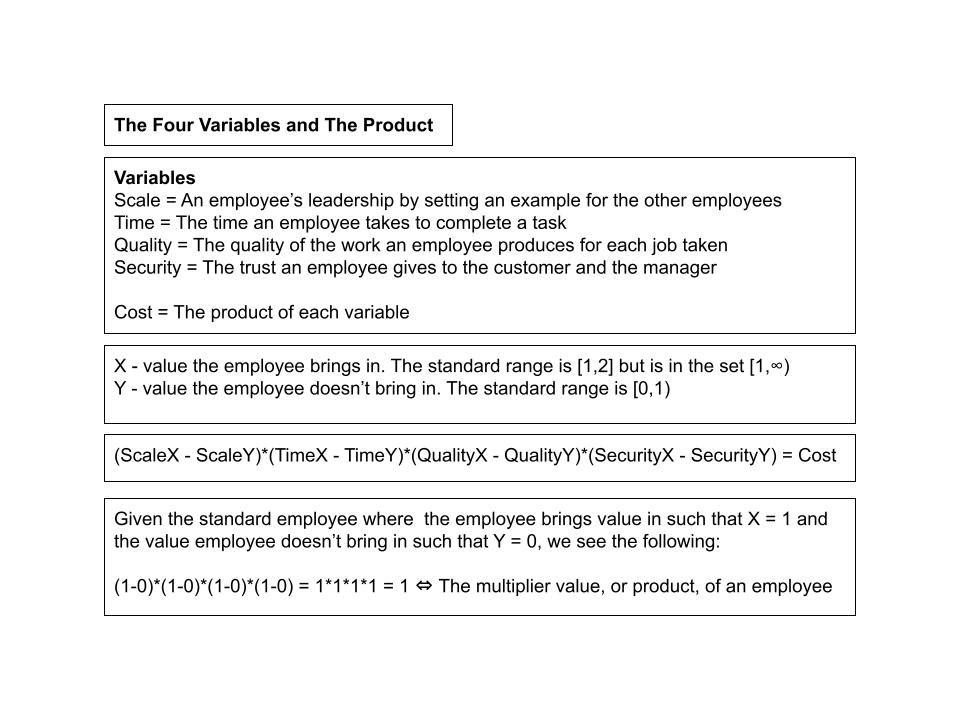
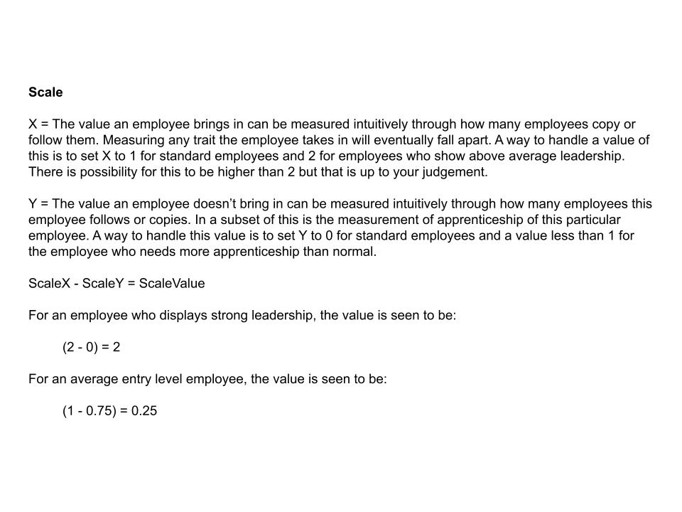
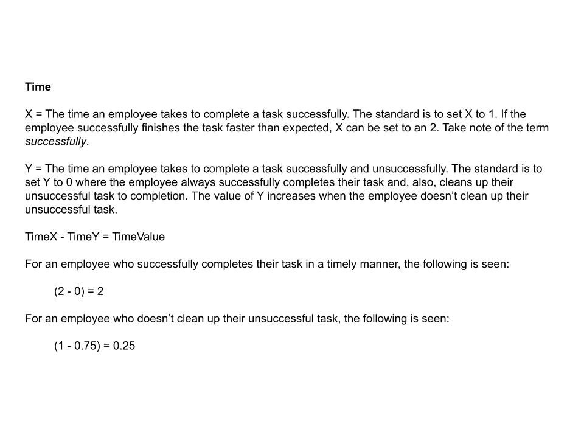
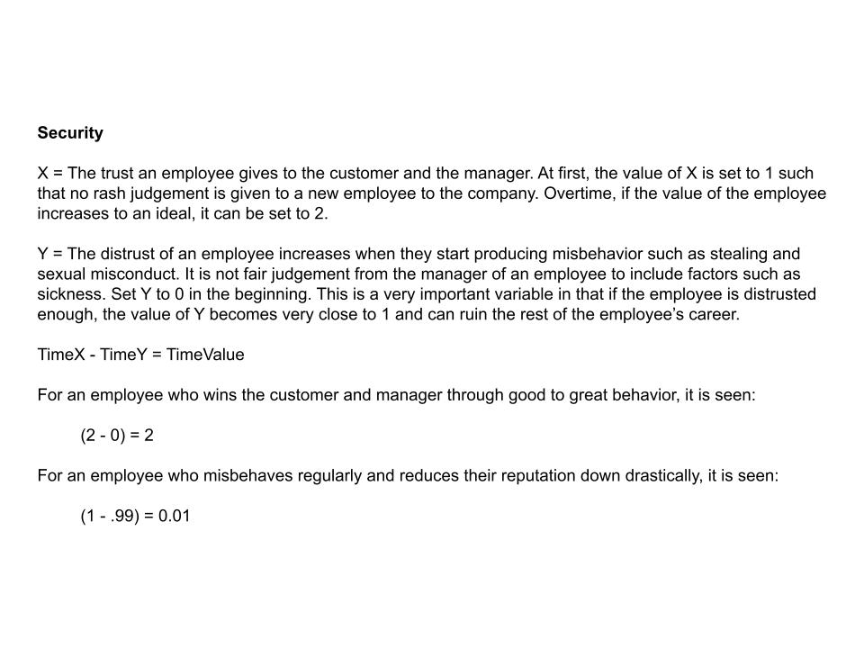
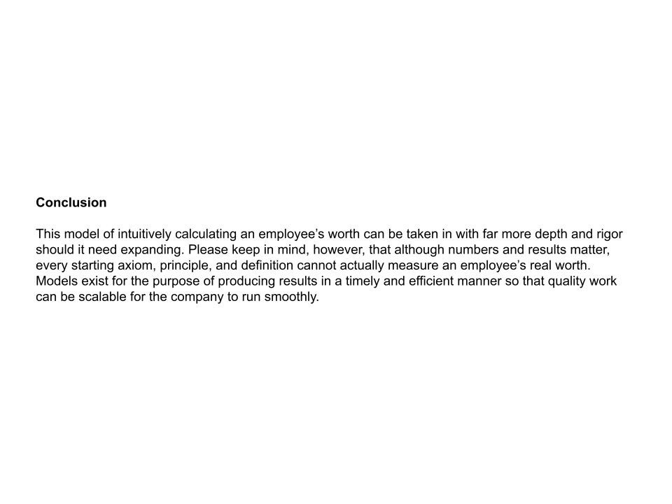

# The Value Of An Employee

### 1. The Four Variables And The Product

### 2. A Measure Of Scale

### 3. A Measure Of Time

### 4. A Mesaure Of Quality

### 5. A Measure Of Security

### 6. The Product Of The Employee

### 7. Conclusion

-----

### References

Ung, E. (2023). [The Human Side Of Supply Chain Management](https://github.com/ericung/humansideofsupplychainmanagement). https://github.com/ericung/humansideofsupplychainmanagement/tree/main
