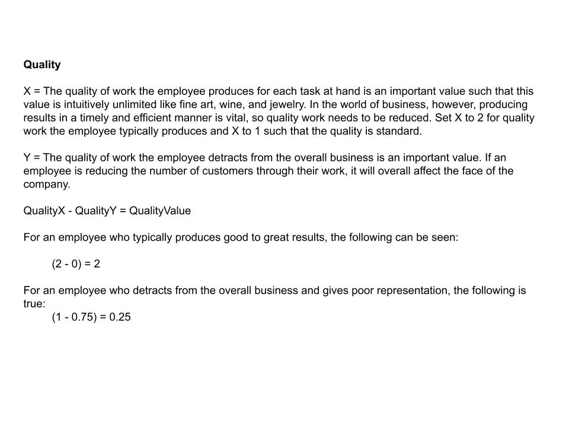

# The Value Of An Employee

### 1. The Four Variables And The Product

### 2. A Measure Of Scale

### 3. A Measure Of Time

### 4. A Mesaure Of Quality

### 5. A Measure Of Security

### 6. The Product Of The Employee

### 7. Conclusion

-----

### References

Maxwell, J. C. (2002). The 17 essential qualities of a team player: Becoming the kind of person every team wants. Thomas Nelson.

Fishbane, P. M., Gasiorowicz, S., & Thornton, S. T. (1996). Physics for scientists and engineers (3rd ed.). Prentice Hall.

Sullivan, M. (2008). Precalculus (8th ed., p. 1152). Prentice Hall.

Ung, E. (2023). [The Human Side Of Supply Chain Management](https://github.com/ericung/humansideofsupplychainmanagement).
